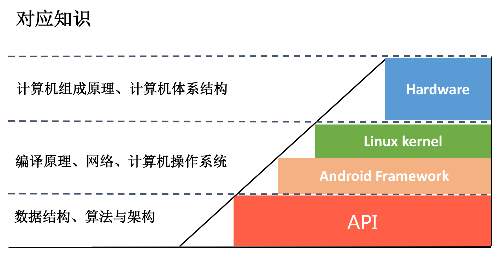

# [Android开发高手课](https://time.geekbang.org/column/intro/142) 实践

## 1 为什么需要学习这个专栏

请参阅：

- [焦虑的移动开发者该如何破局？](https://time.geekbang.org/column/article/69958)
- [如何打造高质量的应用？](https://time.geekbang.org/column/article/70250)

## 2 如何学习这个专栏

### 找对方法学习

在真正开始学习专栏内容之前，务必看看下面文章：

- [想成为Android高手，你需要先搞定这三个问题](https://time.geekbang.org/column/article/81812)
- [专栏学得苦？可能是方法没找对](https://time.geekbang.org/column/article/77342)
- [Android开发高手课学习心得](https://time.geekbang.org/column/article/90167)

课后作业务必要做，如果有疑惑的地方，可以参考 [练习Sample跑起来 | 热点问题答疑](https://time.geekbang.org/column/article/73068) 模块

### 专栏（Android开发高手课）学得苦？可能你还需要一份配套学习书单

作为一名 Android 开发工程师，你需要学习一些 Linux 的基础知识，在做优化时可以有更好的思路。

关于Linux学习，我推荐：

- 《性能之巅：洞悉系统、企业与云计算》
- 《最强Android书：架构大剖析》
- 《极客时间专栏：Linux 性能优化实战》

如果想更好地学习虚拟机以及 Hook 相关的知识，你需要对 C++ 以及编译原理有一定的了解。

关于虚拟机，我推荐：

- 《程序员的自我修养—链接、装载与库》
- 《垃圾回收算法手册：自动内存管理的艺术》

关于编程语言，我推荐：
  
- 《More Effective C++：35个改善编程与设计的有效方法》
- 《Effective Java中文版》（第 3 版）

其他的知识，例如网络、数据库的一些细分领域，我推荐：

- 《Web 性能权威指南》
- 《UNIX 网络编程 卷 1：套接字联网 API》（第 3 版）

具体参考[专栏学得苦？可能你还需要一份配套学习书单](https://time.geekbang.org/column/article/78354)

### 相关学习笔记

- [Android 开发高手课 文章更新学习笔记](https://www.wanandroid.com/blog/show/2436)

## 3 专栏内容概要

**一、高质量开发模块**：

1. 崩溃优化
2. 内存优化
3. 卡顿优化
4. 启动优化
5. IO 优化
6. 存储优化
7. 网络优化
8. 耗电优化
9. UI 优化
10. 包体积优化

目标：从上往下拆解整个知识架构，成为真正的高手，而不是 API 工程师，越底层的东西越不容易过时，像内存管理、文件系统、信号机制、进程调度、系统调用、中断机制、驱动等内容都是共通的，在迁移到新的系统上时可以有一个全局的视角，帮助你快速上手。

**二、高效开发模块**：

1. 如何提升组织与个人的研发效能？（方法论）
   1. 组织的研发效能：
      1. 一个组织持续快速交付价值的能力。
      2. 应用交付的流程：开发阶段、编译和CI阶段、测试阶段、灰度和发布阶段都可以做什么优化？
   2. 个人研发效能：专注（刻意减少身边的诱惑源）；好的方法，包括做事的方法和提问的方法。
2. 编译速度优化：
   1. Android 编译流程
   2. 编译工具：Gradle、Buck、Bazel
   3. 代码优化
   4. 持续交付
3. 编译插桩技术
   1. 应用场景
   2. 字节码知识
   3. 框架：AspectJ、ASM、Redex、ByteBuddy
4. 高效地测试：大数据与 AI
5. 高质量发布
   1. APK 的灰度发布：APK 灰度、动态部署
   2. AB 测试
   3. 统一发布平台：发布平台架构、运营事故应对
6. 数据埋点与上报：
   1. 数据采样
   2. 数据存储
   3. 数据上报
   4. 埋点：统一的埋点数据格式，统一的埋点流程，合适的埋点方式
   5. 大数据平台
7. 线上疑难问题该如何排查和跟踪？
   1. 日志系统
   2. 动态调试

目标：成为有高度的移动开发工程师

1. 从终端到跨端
2. 从平台到中台

**三、架构演讲模块**：

1. 聊聊重构：优秀的架构都是演进而来的。
   1. 什么是架构
      1. 所谓的架构就是面对业务需求场景给出合适的解决方案，使业务能够快速迭代，从而达到“提质增效”的目标；架构只是设计的抽象，对于具体的实现，我们可以称之为框架。
      2. 架构的选型需要关注哪些方面。
   2. 什么是架构演进
      1. 为什么需要做架构演进：架构需要跟随业务的发展而演进。
      2. 如何做架构演进
2. NativeHook
3. 跨平台开发的现状与应用
   1. 跨平台技术
      1. Web
      2. ReactNative 和 Weex
      3. 小程序
   2. 跨平台开发的应用：
      1. 部分业务。某个业务或者页面的跨平台共享，有的时候我们还希望可以做到跨应用。例如“全民答题”的时候，可以看到这个功能可以运行在头条系的各个应用中。一个公司共用同一套跨平台方案有非常重大的意义，业务可以在不同的应用中尝试。
      2. 核心功能。C++ 才是生命力最顽强的跨平台方案，大公司也将越来越多的核心模块往底层迁移，例如网络库、数据上报、加解密、音视频等。
4. 新的开发方向：
   1. 游戏开发
   2. 音视频开发
   3. 边缘智能计算
5. 动态化实践
6. Flutter

**四、番外篇**：

- Android JVM TI 机制
- 专栏学习方法
- 书单推荐
- Native 下如何获得堆栈
- Framework 层学习方法
- Android 面试指南
- 程序员修炼之路：设计能力的提升途径
