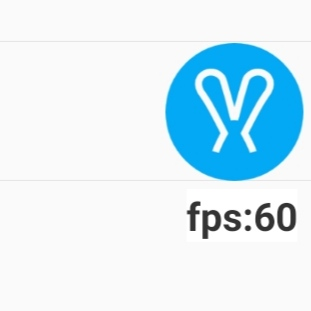
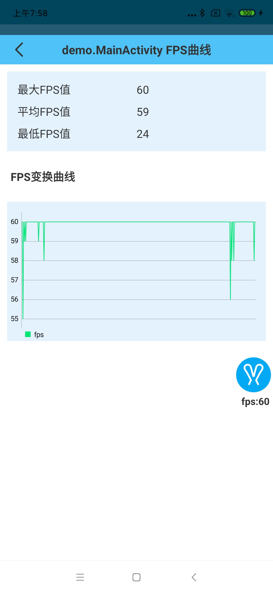
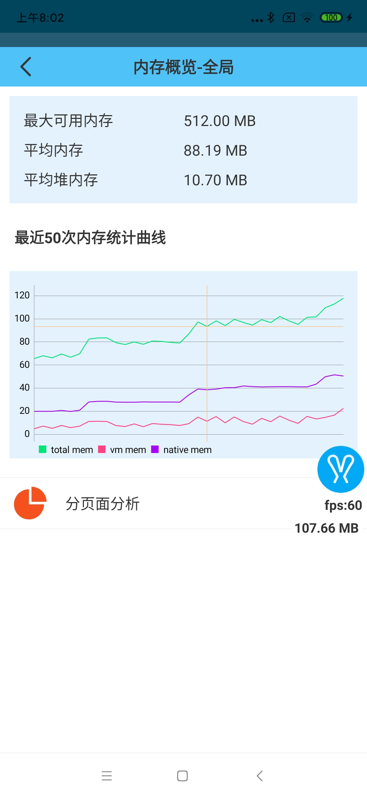
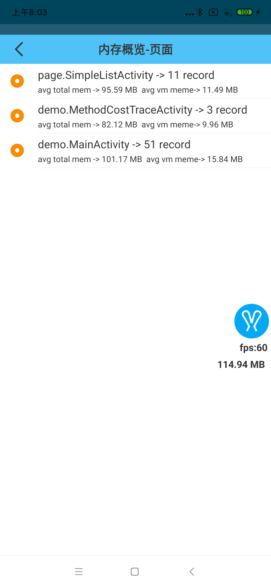

# FPS 与内存监控

## FPS 监控

`rabbit`只会在应用主循环运行时监控应用的`FPS`,并可以自定义`FPS`的计算周期(即多长时间计算一次平均 FPS 值):

```
val rabbitConfig = RabbitConfig()
rabbitConfig.monitorConfig.fpsCollectThresholdNs = TimeUnit.NANOSECONDS.convert(10, TimeUnit.MILLISECONDS)
Rabbit.config(rabbitConfig)
```

> 配置后，在 FPS 监控启动情况下，每 10ms 会计算一次应用的 FPS 值。

### 查看 FPS

当 FPS 监控打开后，实时的 FPS 会显示在`rabbit`浮标上:



也可以分页面查看 FPS:



## 内存监控

`rabiit`通过`Debug.MemoryInfo()`来获取应用的实时内存情况, 可以通过配置来控制内存采样周期:

```
val rabbitConfig = RabbitConfig()
rabbitConfig.monitorConfig.memoryValueCollectPeriodMs = 2000L
Rabbit.config(rabbitConfig)
```

> 配置后，会每 2 秒采集一次内存值。

### 查看当前内存值

当 F 内存监控打开后，实时的内存状态会显示在`rabbit`浮标上:



rabbit 也会统计出每一个页面的内存使用情况:


